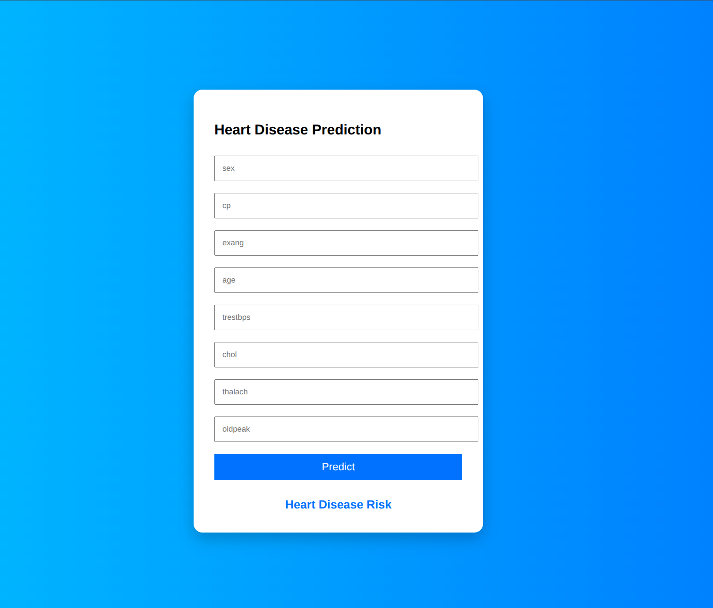

# Heart Disease Predictor

A machine learning web application that predicts the risk of heart disease using a **Decision Tree Classifier**. Users can input key health parameters and get a prediction in real-time.

## 🚀 Deployed App

Try the app live: [Heart Disease Predictor on Render](https://heart-disease-predictor-xeuk.onrender.com/)

## 🖥️ Screenshot


*Replace `screenshot.png` with your actual screenshot file in the repo.*

## 🧩 Features

- Predicts heart disease risk based on user input
- Uses a Decision Tree Classifier trained on selected health parameters
- Clean and responsive UI
- Works entirely online via the web interface

## 📝 Input Parameters

The model requires the following features:

| Feature                        | Description                                        |
|--------------------------------|--------------------------------------------------|
| age                            | Age of the patient                                |
| sex                            | 1 = male, 0 = female                              |
| cp                             | Chest pain type (0-3)                             |
| trestbps                        | Resting blood pressure (mm Hg)                    |
| chol                           | Serum cholesterol (mg/dl)                         |
| fbs                            | Fasting blood sugar > 120 mg/dl (1 = true; 0 = false) |
| restecg                        | Resting electrocardiographic results (0,1,2)     |
| thalach                        | Maximum heart rate achieved                       |
| exang                          | Exercise-induced angina (1 = yes; 0 = no)        |
| oldpeak                        | ST depression induced by exercise relative to rest|
| slope                          | Slope of the peak exercise ST segment (0-2)      |
| ca                             | Number of major vessels colored by fluoroscopy (0-3)|
| thal                           | Thalassemia (0 = normal; 1 = fixed defect; 2 = reversible defect)|

## 🛠️ Technologies Used

- **Python 3**
- **Django 6**
- **Scikit-learn** (Decision Tree Classifier)
- **HTML/CSS** for front-end design
- **Render** for deployment


## ⚡ How to Run Locally

1. Clone the repo:

```bash
git clone https://github.com/yourusername/heart-disease-predictor.git
cd heart-disease-predictor

python3 -m venv venv
source venv/bin/activate

pip install -r requirements.txt


python3 manage.py runserver

```

